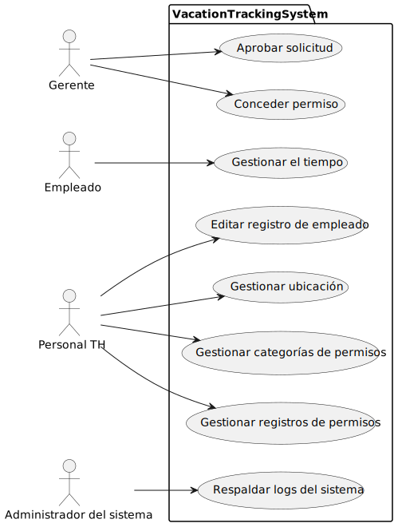
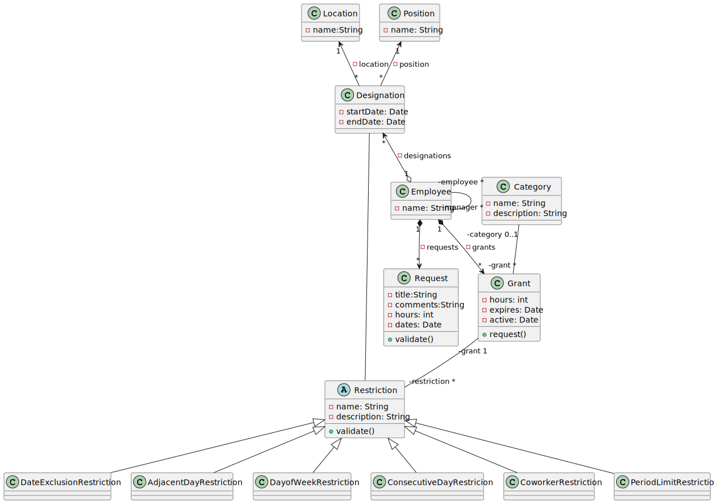

# vacation-tracking
Implementation from Vacaction Tracking System based on the proposal of the book: Object Oriented Analysis and Design with Applications
## Use case model
The top level use case analysis

## Class model
The class model. Added Designation class who not present in original class model.

